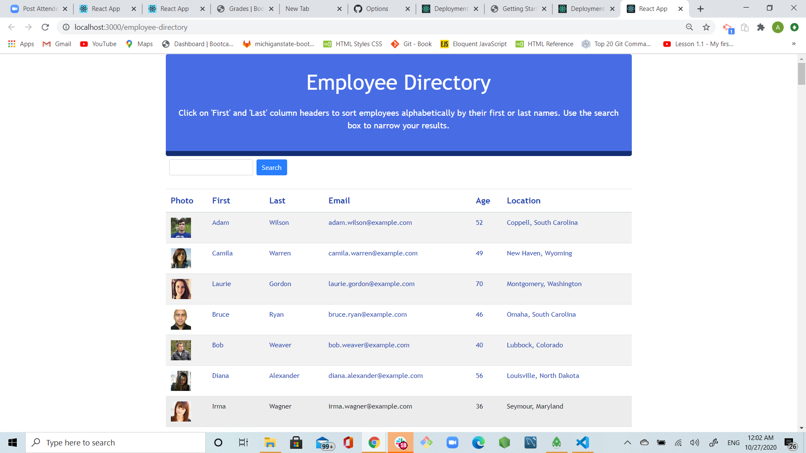
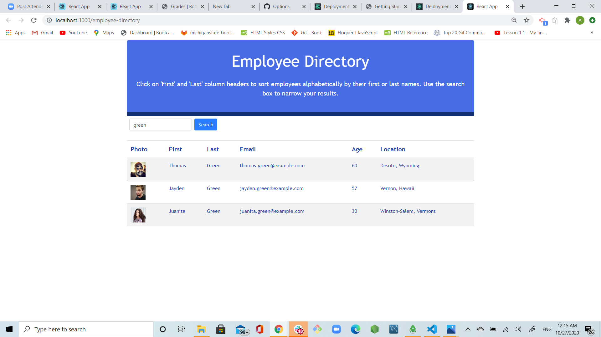
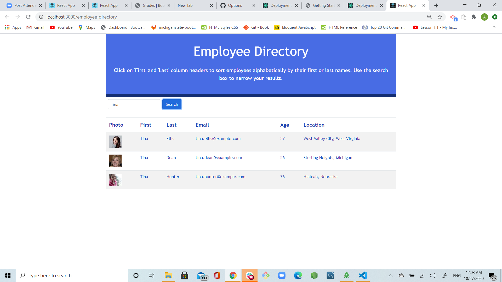
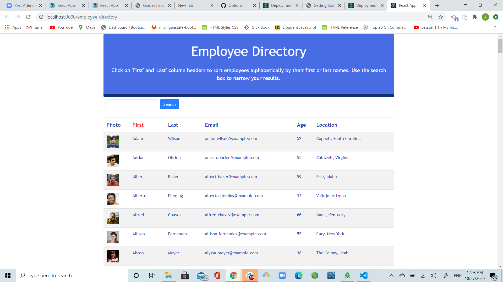
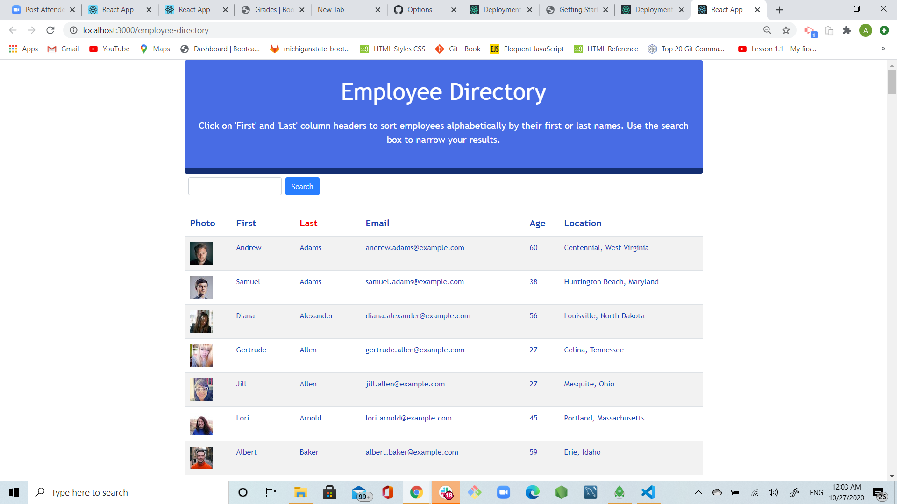

# employee-directory

## Username:

agorelik2

## Title:

### Employee Directory

[Link to the deployed application](https://agorelik2.github.io/employee-directory/.)

## Table of Content

- [Description](#description)
- [User Story](#user-story)
- [Functionality](#functionality)
- [Screen Shots](#screen-shots)
- [Development](#development)
- [Installation](#installation)
- [Dependencies](#dependencies)
- [Built With](#built-with)
- [Repo](#repo)
- [Demo](#demo)
- [Developer](#developer)

## Description

This application is an employee directory with React. An employee or manager would benefit greatly from being able to view non-sensitive data about other employees. User is able to filter employees by either first or last name. Employees list could be also sorted in alphabetical order based on either first or last names.

## User Story

As a user, I want to be able to view my entire employee directory at once so that I have quick access to their information.

## Functionality

- using axios to get a randonly generated list of people from https://randomuser.me/api

```
getUsers: function () {
    return axios.get("https://randomuser.me/api/?results=200&nat=us")
```

- when the user loads the page, a table of employees is rendered. For each employee, the table includes employee's photo, first name, last name, email, age and location (city,state).

The user should be able to:

- Sort the table of employees by first name and last name. To do that, user has to click on the 'First' or 'Last' column header.

- Filter the employees by first name and last name. To do that, user has to enter input into the 'Search' box.

## Screen Shots

The main screen of the application shows


User searched on "green", the employees with the last name "Green" are displayed


User searched on "tina", the employees with the first name "Tina" are displayed


The employees are sorted by first name


The employees are sorted by last name


## Development

The application is broken into five UI components: container.js, header.js, searchBar.js, employeeTable.js, and employeeRow.js. The application development process included managing components' state, and responding to on-click events.

## Installation

To use this application locally:

- Install Node.js on your computer
- Use `npm install` to install all the dependencies, see [Dependencies](#dependencies) for the complete list
- npm install axios
- npm start

## Dependencies

    "@testing-library/jest-dom": "^5.11.5",
    "@testing-library/react": "^11.1.0",
    "@testing-library/user-event": "^12.1.10",
    "axios": "^0.21.0",
    "bootstrap": "^4.5.3",
    "react": "^17.0.1",
    "react-dom": "^17.0.1",
    "react-scripts": "4.0.0",
    "web-vitals": "^0.2.4"

## Built With

- [VScode](https://code.visualstudio.com/)
- [Gitbash](https://gitforwindows.org/)
- [node.js](https://nodejs.org/en/)
- [express.js](https://expressjs.com/)
- [react.js](https://reactjs.org/)

## Repo:

https://github.com/agorelik2/employee-directory

## Demo:

## Developer

    Alina Gorelik
